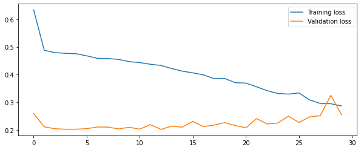
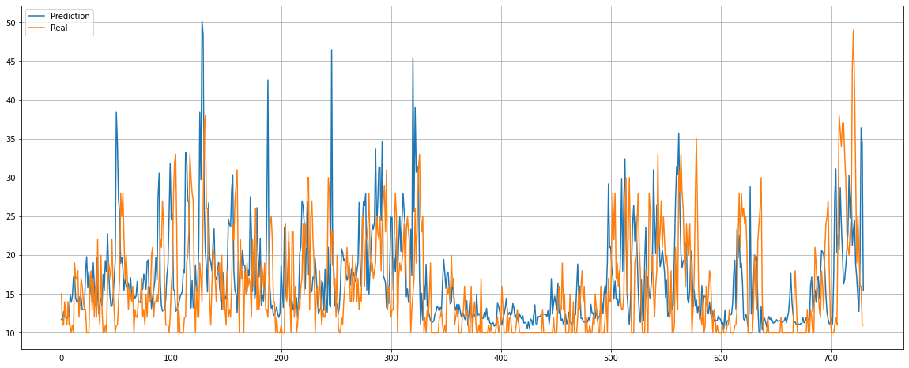
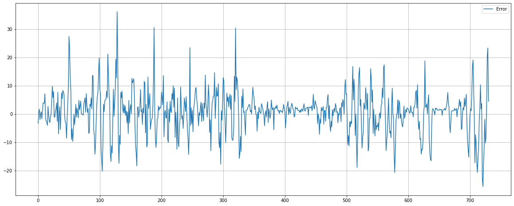

# Models-Data 

## ml04.h5

### Architecture
```python
model = Sequential()
model.add(LSTM(128, activation='relu', input_shape=(trainX.shape[1], trainX.shape[2]), return_sequences=True))
model.add(LSTM(64, activation='relu', return_sequences=True))
model.add(LSTM(32, activation='relu', return_sequences=False))
model.add(Dropout(0.2))
model.add(Dense(trainY.shape[1]))

model.compile(optimizer='adam', loss='mean_squared_error')

history = model.fit(trainX, trainY, epochs=30, batch_size=14, validation_split=0.1, verbose=1)
```
### Loss chart

### Prediction vs Real values 

### Error chart
